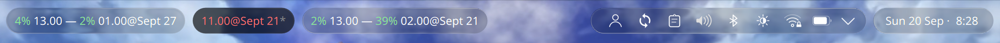
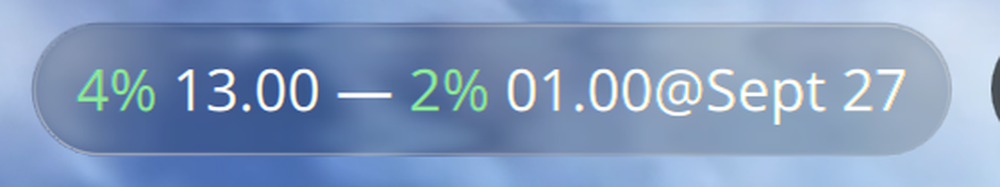

# Plasma Liquid Glass: an iOS-style glass top bar for KDE Plasma 6




The top bar becomes a row of clear glass pills. You see the wallpaper through
them, it bends at each pill's edge like a water drop, and a thin rim catches the
light. Maximize a window and the bar goes flat and solid, out of the way.

## TL;DR

1. Install Panel Colorizer, with its C++ plugin.
2. Build my fork of the Glass KWin effect. Log out and in.
3. Copy two presets, run two scripts.

Needs `sudo` once, for the effect. Undo is four commands, at the bottom.

Tested on Plasma 6.6.6, Wayland, display scale 2 and 2.5.

## Parts

| Part | Job |
| --- | --- |
| [Panel Colorizer](https://github.com/luisbocanegra/plasma-panel-colorizer) | Cuts the panel into pills and tells KWin which areas to blur |
| [kwin-effects-glass, `per-pill-glass` branch](https://github.com/Nael-Nathanael/kwin-effects-glass/tree/per-pill-glass) | Draws the glass: bend, rim, blur |
| `presets/` | Panel Colorizer presets: `Bubbles` (pills), `Bar` (maximized), `Dock` (one slab) |
| `setup-panel.sh` | Builds the top bar, sets the clock, wires preset auto-loading. `--dock` adds a dock, `--popups` restyles notifications |
| [WhiteSur](https://github.com/vinceliuice/WhiteSur-kde), a few files | The dock's running-app dot, the popups' rounded shape. Fetched by `--dock` and `--popups`, not bundled |
| `glass-settings.sh` | The Glass effect settings |
| `sampler/` | Optional. Colours the maximized bar like the window's title bar |

The fork is needed. Upstream draws one glass shape around the whole panel, so
only the bar's outer edge bends. The branch draws one shape per pill, and ships
the shader names KWin 6.6 looks for.

## Install

Do these in order.

1. Install Panel Colorizer **with its C++ plugin**. Without the plugin it cannot
   set blur areas and Glass has nothing to draw on. Follow its README.

2. Build and install the Glass fork. Dependencies are listed in its README.

   ```
   git clone -b per-pill-glass https://github.com/Nael-Nathanael/kwin-effects-glass
   cd kwin-effects-glass && mkdir build && cd build
   cmake .. -DCMAKE_INSTALL_PREFIX=/usr -DCMAKE_BUILD_TYPE=Release
   make -j"$(nproc)"
   sudo make install
   ```

3. Log out and log in. KWin keeps an already-loaded effect in memory; a new
   build only takes over after re-login.

4. Copy the presets:

   ```
   git clone https://github.com/Nael-Nathanael/plasma-liquid-glass
   mkdir -p ~/.config/panel-colorizer/presets
   cp -r plasma-liquid-glass/presets/* ~/.config/panel-colorizer/presets/
   ```

5. Build the bar:

   ```
   sh plasma-liquid-glass/setup-panel.sh          # top bar
   sh plasma-liquid-glass/setup-panel.sh --dock   # top bar and a glass dock
   sh plasma-liquid-glass/setup-panel.sh --dock --popups   # and frosted notifications
   ```

   It reuses your top panel if you have one, else makes one. It adds Panel
   Colorizer (hidden, or its icon becomes one more pill), loads `Bubbles`, and
   sets auto-loading: *Maximized window* → `Bar`, *Normal* → `Bubbles`. It sets
   the clock to one line, `20 Sep 12:24`. Safe to run again.

   `--dock` adds a bottom panel shaped like the WhiteSur one: as wide as its
   icons, centered, floating, moves out of a window's way. It gets the `Dock`
   preset, the same glass as the pills but as one slab. Your pinned apps are set
   once, when the dock is made, and left alone after that.

   `--popups` makes notifications, and the tray's popups with them, rounded
   frosted glass, and puts notifications top right.

   By hand instead: add the Panel Colorizer widget to the panel, then in its
   settings load `Bubbles` and set the same auto-loading.

6. Apply the Glass settings:

   ```
   sh plasma-liquid-glass/glass-settings.sh
   ```

7. Optional: make the maximized bar match the window under it.

   ```
   sh plasma-liquid-glass/sampler/install.sh
   ```

   See [The bar takes the window's colour](#the-bar-takes-the-windows-colour).

The `Bubbles` preset hides the panel's own background (`nativePanel` opacity 0).
Glass needs the wallpaper behind the pills, not a panel fill.

`Bar` is the opposite: a flat, solid bar. Dark grey with white text as it ships.

### The bar takes the window's colour

With `sampler/` installed, the bar under a maximized window takes the colour of
that window's title bar, so the two read as one surface. Text turns dark on a
light title bar and white on a dark one.

Panel Colorizer cannot do this: its colours come from a fixed value or from the
system theme. Asking the window for its colour scheme does not work either. That
is what Latte Dock did, and it only knows KDE apps. GTK and Electron apps draw
their own title bar. So this looks at the pixels:

- `sampler/kwin-script` tells the sampler when the active window is maximized,
  and where it is. KWin scripts cannot read pixels.
- `glassbar-sampler` reads a one pixel high strip across the top of the title bar,
  takes the most common colour so the title text does not count, writes it into
  the `Bar` preset in `~/.config`, and has Panel Colorizer load the preset again.

KWin only lets a program read the screen if a `.desktop` file for that exact
program lists `org.kde.KWin.ScreenShot2`. The installer writes that file to
`~/.local/share/applications`, for `~/.local/bin/glassbar-sampler` alone. That is
why the sampler is a small compiled program and not a script: a script would
need the permission given to all of Python. No `sudo`.

Limits: it looks when a window is maximized or activated, not all the time, so
an app that changes its title bar colour later keeps the old bar until then. One
monitor has been tested. If you rebuild the top panel, run `install.sh` again:
the panel's ids are in the sampler's start command.

To remove it:

```
pkill -f glassbar-sampler
rm ~/.config/autostart/io.github.naelnathanael.glassbar-sampler.desktop \
   ~/.local/share/applications/io.github.naelnathanael.glassbar-sampler.desktop \
   ~/.local/bin/glassbar-sampler
kpackagetool6 -t KWin/Script -r glassbar-sampler
```

### What `--dock` and `--popups` change outside the panel

Plasma draws the highlight behind the active app, and the background of every
popup, from the Plasma style, and a style is global. The script makes a style
named `WhiteSur Parts` with only the WhiteSur files it needs, and switches to it.
Plasma takes every file a style does not have from Breeze, so nothing else
changes. It needs `curl` and a network connection.

| Flag | Files | What you see |
| --- | --- | --- |
| `--dock` | `widgets/tasks.svgz` | A dot under running apps, a rounded highlight |
| `--popups` | `dialogs/background.svgz`, `widgets/plasmoidheading.svgz` | Rounded glass notifications and tray popups |

WhiteSur's popup background is clear glass, and text on clear glass is hard to
read over a dark window. So `--popups` also sets a milky `TintColor` in the Glass
effect, with `ExcludeDocks` so the pills and the dock stay clear. A style cannot
tell a notification from a tray popup, so both change. It also turns off the
coloured timeout line, which is a Plasma setting (`ShowPopupTimeout`).

What stays Plasma's: the strip with the app name, and the icon on the right.
Those are the notification widget's layout, not the style, and the widget's QML
is compiled into `org.kde.plasma.notifications.so`. Changing them means building
a fork of that widget from the plasma-workspace source, for every Plasma update.

Light or dark follows your colour scheme. To force it:
`WHITESUR_VARIANT=WhiteSurLiquid-dark sh plasma-liquid-glass/setup-panel.sh --dock --popups`.

### Taking Panel Colorizer off a panel

Remove the widget, then restart the shell: `systemctl --user restart
plasma-plasmashell`. Panel Colorizer restyles the panel's items in place, and its
pills stay painted until the shell starts again.

### The clock is the wrong size

The Digital Clock does not use the panel font. It has its own size, and it shrinks
the text to fit the pill, so the number is not points or pixels. `setup-panel.sh`
sets 17, which matches a 10pt panel font at display scale 2. Too big or too small
next to the other pills? Run it again with another number:

```
CLOCK_FONT_SIZE=15 sh plasma-liquid-glass/setup-panel.sh
```

## Check that Glass is drawing

Glass can be listed as loaded and still draw nothing. Prove it with a loud tint:

```
kwriteconfig6 --file kwinrc --group Effect-blurplus --key TintColor '#ccff0000'
qdbus6 org.kde.KWin /Effects org.kde.kwin.Effects.reconfigureEffect glass
```

Pills turn red = working. Then remove it:

```
kwriteconfig6 --file kwinrc --group Effect-blurplus --key TintColor --delete
qdbus6 org.kde.KWin /Effects org.kde.kwin.Effects.reconfigureEffect glass
```

No red: run `journalctl --user -b | grep -i 'shader\|not linked'`.
`Failed to read shader ... _core.vert` means KWin is running a build without the
branch's shader fix — reinstall, then re-login.

## Tuning

All in `~/.config/kwinrc`, group `[Effect-blurplus]`, or System Settings →
Desktop Effects → Glass.

- `RefractionStrength` — how hard the edge bends. Glass only sees the strip of
  wallpaper under each pill, so very high values streak. 14 stays clean.
- `RefractionEdgeSize` — width of the bending band.
- `RimSpecularScale` — rim brightness, 0–20.
- Pill darkness is in the preset: `widgets.normal.backgroundColor.alpha`.

## After a KWin update

Binary effects break on every KWin update. Rebuild the fork, `sudo make install`,
re-login.

## Undo

```
kwriteconfig6 --file kwinrc --group Plugins --key glassEnabled false
kwriteconfig6 --file kwinrc --group Plugins --key blurEnabled true
qdbus6 org.kde.KWin /Effects org.kde.kwin.Effects.unloadEffect glass
qdbus6 org.kde.KWin /Effects org.kde.kwin.Effects.loadEffect blur
```

If you used `--dock` or `--popups`, go back to the Breeze style too:

```
plasma-apply-desktoptheme default
rm -r ~/.local/share/plasma/desktoptheme/WhiteSurParts
kwriteconfig6 --file kwinrc --group Effect-blurplus --key TintColor --delete
kwriteconfig6 --file kwinrc --group Effect-blurplus --key ExcludeDocks --delete
kwriteconfig6 --notify --file plasmanotifyrc --group Notifications --key ShowPopupTimeout true
```

The panels themselves are yours: remove them from panel edit mode.

## Credits

- [4v3ngR/kwin-effects-glass](https://github.com/4v3ngR/kwin-effects-glass) — the Glass effect
- [luisbocanegra/plasma-panel-colorizer](https://github.com/luisbocanegra/plasma-panel-colorizer)
- [vinceliuice/WhiteSur-kde](https://github.com/vinceliuice/WhiteSur-kde) — the dock's shape, the task indicators, the popup background (GPL-3.0)

## License

MIT for the files in this repository. The Glass fork stays GPL-3.0.
